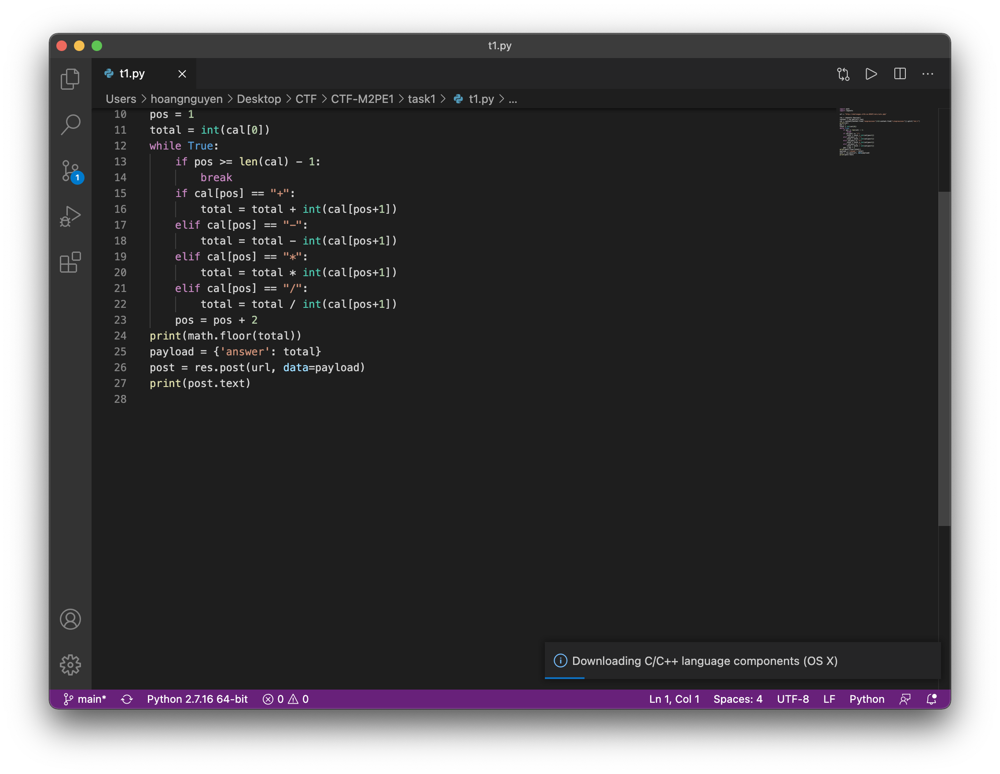
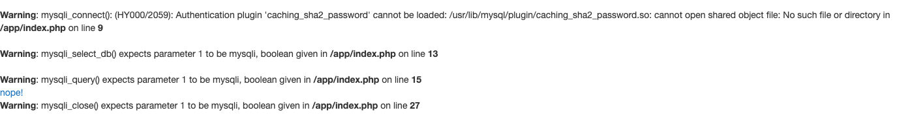
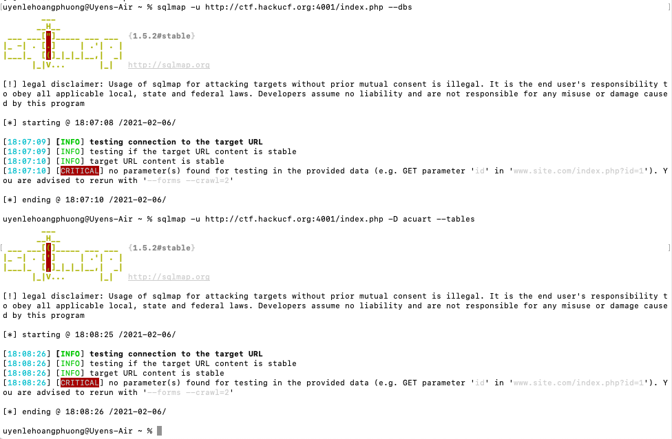
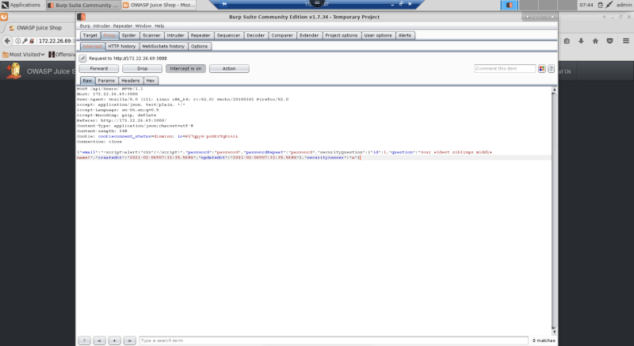
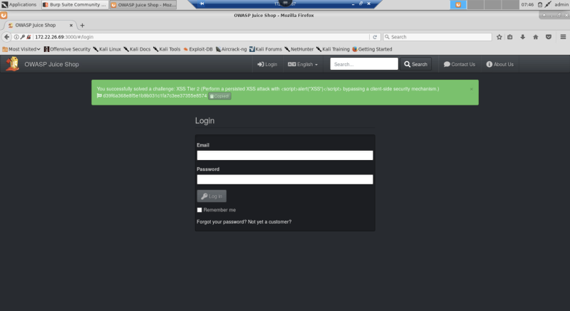

Team: 404 Name Not Found
----------
<b>Task 1:</b> flag{you_should_have_solved_this_in_ruby} 
The script is located in task1 folder, named t1.py 
  
<b>Task 2:</b> For task 2, we have tried SQL injection by using multiple login usernames and passwords to login to the website. Some of the usernames and passwords that we have used are:  ‘ or 1=1--, ‘; DROP ALL DATABASE; admin’—,iamhacker’—, debug’ or 1=1,.. 
 
We also tried with sqlmap but it didn’t work out.  
 
We also tried to work with the URL. We had some URL like:  
http://ctf.hackucf.org:4001/index.php?username=iamhacker%27or1=1 
http://ctf.hackucf.org:4001/index.php?username=debug%27or1=1 

<b>Task 3:</b> using BURP suite, we intercepted POST package after email verification at signup, editted to include the xss script then forward the editted POST package to server 
  
After that we stopped intercepting and received the flag confirmation, which returned correct on Proving Ground  

